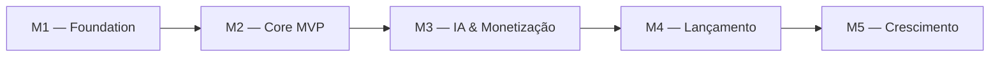

# Talvrix — Roadmap

**Produto:** Talvrix  
**Empresa:** Kairos Labs  
**Versão:** 1.0  
**Data:** 2026-08-07  

---

## Visão Geral

| Milestone | Descrição | Status | Issues |
|---|---|---|---|
| M1 — Foundation | Scaffold, auth, banco de dados | 🔜 Não iniciado | #1, #2 |
| M2 — Core MVP | Upload, scraping, resultados básicos | 🔜 Não iniciado | #3, #4, #5 |
| M3 — IA & Monetização | Matching IA, Stripe, planos pagos | 🔜 Não iniciado | #6, #7 |
| M4 — Lançamento | Deploy produção, landing page, beta | 🔜 Não iniciado | #8, #9 |
| M5 — Crescimento | Multi-site, alertas, expansão LATAM | 🔜 Não iniciado | #10, #11, #12 |

---

## M1 — Foundation
**Objetivo:** Projeto funcional localmente com autenticação e banco configurados.  
**Critério de conclusão:** Usuário consegue criar conta, fazer login e acessar dashboard vazio.

| # | Issue | Tipo |
|---|---|---|
| #1 | Inicializar projeto Next.js 14 com TypeScript e Tailwind | chore |
| #2 | Configurar Supabase Auth e banco de dados | chore |

---

## M2 — Core MVP
**Objetivo:** Usuário faz upload do currículo, o sistema busca vagas e exibe lista ordenada por salário — sem IA.  
**Critério de conclusão:** Fluxo completo funcionando com o site Nerdin. Plano Free operacional.

| # | Issue | Tipo |
|---|---|---|
| #3 | Implementar upload de currículo em PDF | feat |
| #4 | Implementar scraper de vagas (Nerdin) | feat |
| #5 | Implementar tela de resultados ordenados por salário | feat |

---

## M3 — IA & Monetização
**Objetivo:** Matching semântico por IA ativo para planos pagos. Stripe integrado com os 4 planos.  
**Critério de conclusão:** Usuário assina Basic, faz busca e recebe score de compatibilidade por vaga.

| # | Issue | Tipo |
|---|---|---|
| #6 | Implementar matching por IA via Claude API (planos pagos) | feat |
| #7 | Configurar Stripe e planos de assinatura | chore |

---

## M4 — Lançamento
**Objetivo:** Produto em produção, publicamente acessível, com landing page e primeiros usuários beta.  
**Critério de conclusão:** 10 usuários beta ativos, produto estável em produção.

| # | Issue | Tipo |
|---|---|---|
| #8 | Criar landing page e página de pricing | feat |
| #9 | Deploy em produção (Vercel + Supabase) e testes beta | chore |

---

## M5 — Crescimento
**Objetivo:** Expansão de funcionalidades para planos Pro e Enterprise. Início da expansão LATAM.  
**Critério de conclusão:** 150 usuários pagantes, suporte a 5 sites simultâneos.

| # | Issue | Tipo |
|---|---|---|
| #10 | Suporte a múltiplos sites simultâneos (plano Pro) | feat |
| #11 | Alertas automáticos por e-mail de novas vagas compatíveis | feat |
| #12 | Atualizar URL do site no LICENSE quando domínio customizado for configurado | docs |

---

## Issues fora de milestone (backlog)

| # | Issue | Tipo | Motivo |
|---|---|---|---|
| — | Suporte a interface em espanhol (expansão LATAM) | feat | Pós M5 |
| — | API pública para headhunters (plano Enterprise) | feat | Pós M5 |
| — | App mobile (React Native) | feat | Pós receita estável |

---

*Talvrix — Kairos Labs | Roadmap v1.0*
